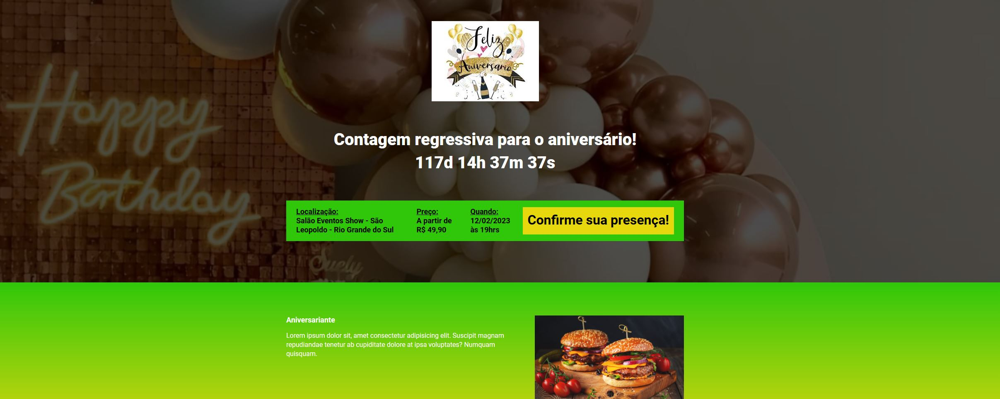

<h1 align="center">
  
<a href="https://ebac-tech-talks-hazel-pi.vercel.app/">projeto_evento_aniversario</a>

</h1>

  

   <h3>Tecnologias utilizadas</h3>
  
  
  
  
  
  
  

 
 

   
Este repositório contém o código-fonte do projeto desenvolvido durante o Módulo 22 do curso de Engenheiro Front End da EBAC. Neste módulo, aprendemos a criar uma landing page para um evento fictício, utilizando o <a href="https://parceljs.org/">Parcel</a> e a biblioteca <a href="https://michalsnik.github.io/aos/">AOS</a>.

   <h2>Descrição do Projeto</h2>

   
A landing page criada é para um evento fictício chamado "projeto_evento_aniversario". O destaque do projeto é a inclusão de um contador regressivo que mostra a contagem regressiva da data atual até a data estipulada para o evento. Como desafio pessoal, o contador teve sua cor alterada e uma mensagem foi adicionada após a expiração da data do evento.

  
Para adicionar animações à página, utilizamos a biblioteca AOS (Animate On Scroll) disponível em https://michalsnik.github.io/aos/. Essa biblioteca permite criar animações baseadas no scroll da página, tornando a experiência do usuário mais interativa e atraente. 

  
O foco do projeto foi utilizar a ferramenta Parcel como bundler e o SASS como pré-processador de CSS, seguindo a metodologia BEM (Block Element Modifier) para boas práticas na estruturação do código CSS.

   <h2>Recursos Utilizados</h2>
  <ul>
    <li>HTML 5</li>
    <li>SASS (SCSS)</li>
    <li>JavaScript</li>
    <li>Parcel (Bundler)</li>
    <li>Biblioteca AOS (Animate On Scroll)</li>
    <li>Metodologia BEM (Block Element Modifier)</li>
    <li>Vercel (deploy)</li>
  </ul>
  
  <h2>Visualização Online</h2>
  
A landing page do projeto está disponível para visualização na Vercel. Você pode acessá-la através do seguinte link:

https://projeto-evento-aniversario.vercel.app/
   <h2>Autor</h2>

   
Este projeto foi realizado por <a href="https://pagina-portifolio-five.vercel.app/" target="_blank"><b>Diego Pazzini</b></a> e desenvolvido como parte do curso de Desenvolvedor Full Stack Java da EBAC.

   
Agradeço por visitar o repositório do exercício do Módulo 22 - Landing Page de Evento! 
      Fique à vontade para entrar em contato caso tenha alguma dúvida ou sugestão.

  
 <h2>
    Pré-visualização
 </h2>
  <h3>Landing Page de Evento</h3>
  
 
 
 

<h2>Contatos</h2>

 
 
  

